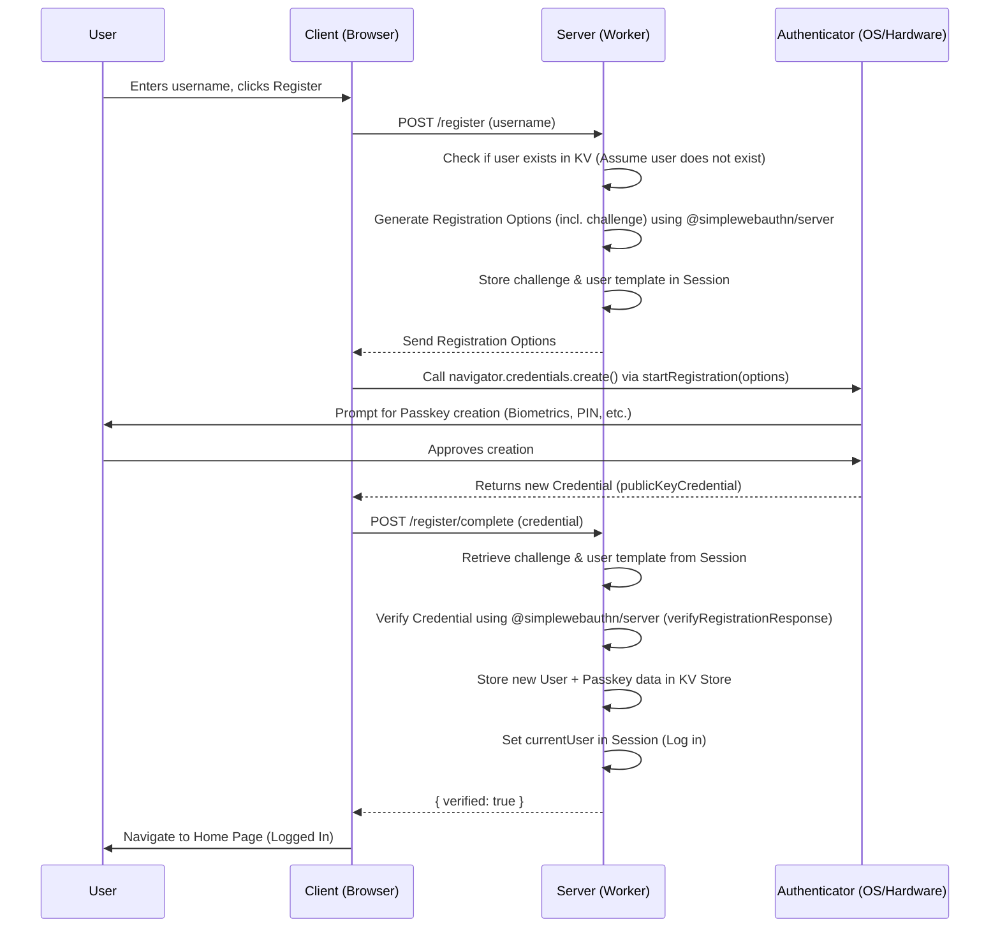
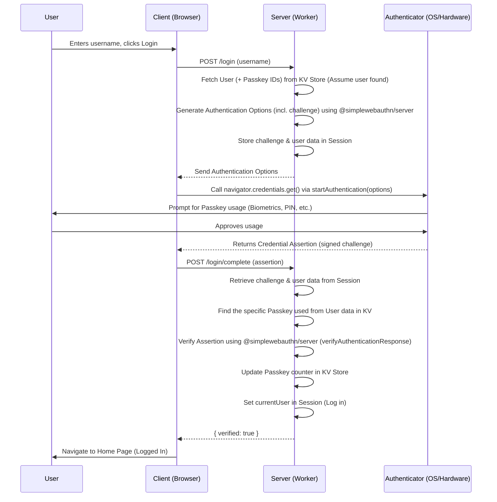

# Passkey Project Demo

This project demonstrates a basic implementation of passwordless authentication using Passkeys (WebAuthn) with a React frontend and a Hono backend running on Cloudflare Workers.

## Features

*   User registration with Passkeys
*   User login with Passkeys
*   Secure session management
*   Uses Cloudflare Workers KV for user data storage

## Technology Stack

*   **Frontend:** React, TypeScript, Vite, React Router, Tailwind CSS
*   **Backend:** Hono (running on Cloudflare Workers), TypeScript
*   **Authentication:** `@simplewebauthn/browser`, `@simplewebauthn/server`
*   **Database:** Cloudflare KV Store

## Project Structure

*   `/client`: Contains the React frontend application.
*   `/server-worker`: Contains the Hono backend application for Cloudflare Workers.

## Setup and Installation

### Prerequisites

*   Node.js and npm (or yarn)
*   Cloudflare account and `wrangler` CLI installed (`npm install -g wrangler`)

### Installation

1.  **Clone the repository:**
    ```bash
    git clone <your-repository-url>
    cd <your-repository-name>
    ```

2.  **Install Client Dependencies:**
    ```bash
    cd client
    npm install
    cd ..
    ```

3.  **Install Server Dependencies:**
    ```bash
    cd server-worker
    npm install
    cd ..
    ```

### Configuration

1.  **Cloudflare KV Namespace:**
    *   Create a KV namespace in your Cloudflare dashboard.
    *   Add the namespace binding to your `server-worker/wrangler.toml` file:
        ```toml
        # wrangler.toml
        name = "your-worker-name"
        main = "src/index.ts"
        compatibility_date = "YYYY-MM-DD" # Use a recent date

        kv_namespaces = [
          { binding = "users", id = "YOUR_KV_NAMESPACE_ID", preview_id = "YOUR_KV_PREVIEW_NAMESPACE_ID" }
        ]

        [vars]
        SESSION_SECRET = "your-secure-random-session-secret" # Change this!
        ```
    *   Replace `YOUR_KV_NAMESPACE_ID` and `YOUR_KV_PREVIEW_NAMESPACE_ID` with your actual KV namespace IDs.
    *   Set a strong `SESSION_SECRET` in the `[vars]` section.

### Running the Project

1.  **Run the Server Worker (Development):**
    *   Navigate to the server directory: `cd server-worker`
    *   Start the development server: `pnpm run dev`
    *   Note the local URL wrangler provides (e.g., `http://localhost:8787`).

2.  **Run the Client (Development):**
    *   Navigate to the client directory: `cd client`
    *   Ensure the API endpoint in `client/lib/api.ts` (or wherever your API calls are defined) points to the worker's URL (e.g., `http://localhost:8787`). You might need to adjust this based on your setup.
    *   Start the development server: `pnpm run dev`
    *   Open your browser to the URL provided by Vite (e.g., `http://localhost:5173`).

## Passkey Authentication Flow

### Registration

This diagram shows the successful sequence of events when a new user registers with a Passkey.



### Login

This diagram shows the successful sequence of events when an existing user logs in with their Passkey.

